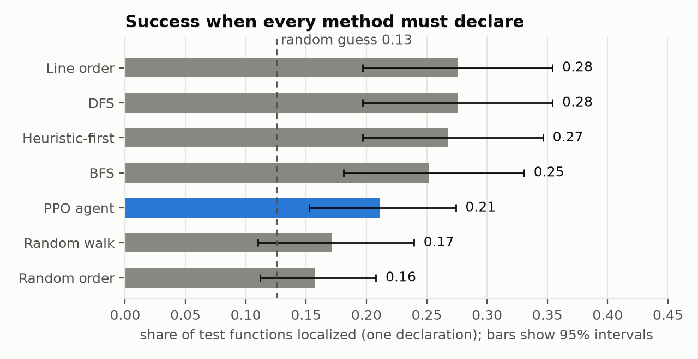
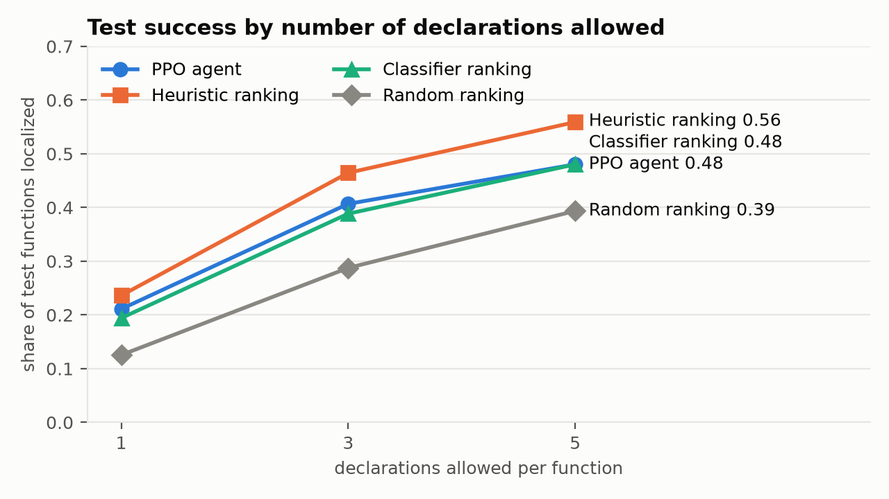
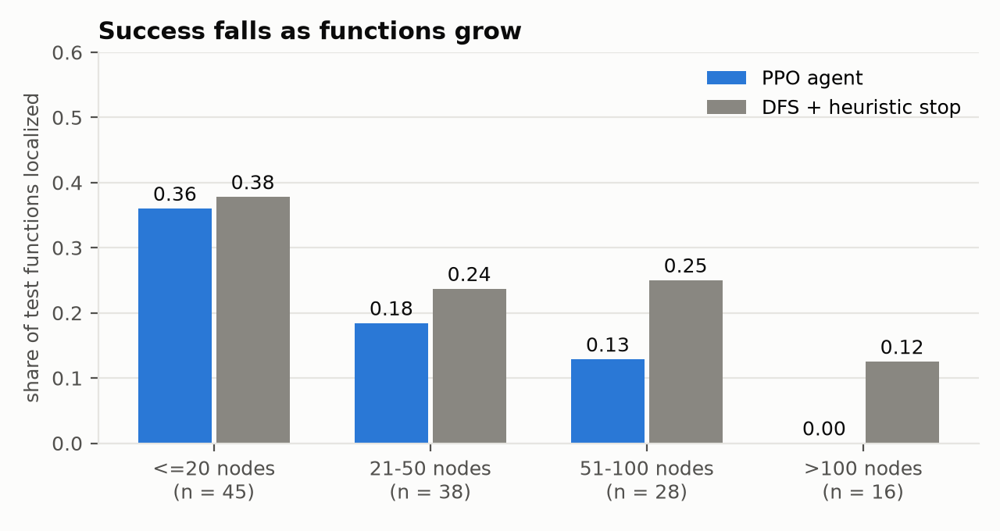
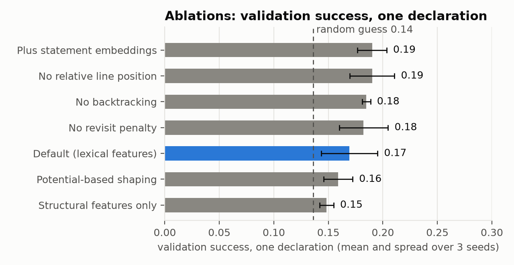

# Soren: A Reinforcement Learning Agent for Source-Level Vulnerability Localization

Karan Kumar (23BPS1034), Aryan Kumar (23BPS1193)

## Abstract

Soren treats vulnerability localization as a navigation problem. Given a C or C++ function
known to be vulnerable, an agent walks the function's control flow graph one statement at a
time and declares the statement it believes is the flaw. We built the full pipeline: BigVul
functions to line-level control flow graphs with Joern, a masked-action Gymnasium environment,
a PPO agent, traversal baselines under two evaluation protocols, and a visualizer that replays
the agent's path.

On 127 held-out test functions the agent localizes the vulnerable statement in 21.1% of cases
with one declaration, against 12.5% for a random guess. It does not beat simple baselines:
walking the function in depth-first or line order and stopping at the first statement with a
suspicious lexical flag reaches 27.6%, a difference that is not statistically significant at
this sample size. A supervised classifier that sees every statement at once does no better
than 19 to 24% at top-1, with or without CodeBERT embeddings. We conclude that the limit is
the per-statement representation, not the search policy: whether a statement is a flaw
depends on context that neither our features nor a one-hop view can see.

## 1. Introduction

Most learned vulnerability detectors, whether graph neural networks or Transformers, read a
whole function in one pass and output a single label: vulnerable or not. They do not say
where, and they do not model the search a human reviewer performs.

Soren reformulates the task as sequential decision-making. The function is a control flow
graph (CFG); the agent stands on one statement, sees that statement and its successors, and
chooses to move, backtrack, or declare. A policy learned this way is interpretable in a way a
classifier is not: its path through the code can be replayed and inspected.

The question we set out to answer is whether a learned navigation policy finds the vulnerable
statement more efficiently than uninformed traversals such as breadth-first and depth-first
search. The honest answer, on this dataset and with these features, is no. Most of this
report explains why, because the reasons are more useful than the headline number.

## 2. Related work

**Function-level detection.** Devign and ReVeal apply graph neural networks to code property
graphs; LineVul and related models fine-tune Transformers. They report strong detection
scores on BigVul, though later work has shown these drop sharply under realistic splits and
de-duplication.

**Statement-level localization.** LineVul ranks lines by attention weight; IVDetect and
VELVET attribute a function-level prediction to statements or train node-level classifiers.
These rank all statements of a function at once.

**Reinforcement learning on graphs.** RL has been used for graph navigation in knowledge-base
reasoning and for program analysis tasks such as fuzzing guidance. We are not aware of prior
work that trains an agent to walk a CFG to localize a vulnerability.

## 3. Problem formulation

Given a vulnerable function with CFG `G = (V, E)` and a set of vulnerable statements
`V* ⊆ V`, the agent starts at the function's entry and must issue a declaration on a node in
`V*`.

**State.** The agent observes a vector of 248 values in [0, 1]: the 30 features of the
current node; whether it has been visited or declared; six successor slots, each holding a
successor's 30 features, a visited flag and a back-edge flag; a summary of the node it would
backtrack to; and episode context (fraction of the step budget used, fraction of nodes
visited, stack depth, graph size, declarations left). It sees one hop ahead, so the problem is
partially observable.

**Node features.** Tier S (17 structural features): node kind, in- and out-degree, depth,
loop membership, relative line position. Tier L, the default, adds 13 lexical flags: whether
the statement calls a dangerous API, an allocator or a deallocator; whether it has an array
subscript, pointer dereference, pointer arithmetic, arithmetic, a comparison, `sizeof` or a
cast; whether it mentions a length-like identifier; and its token count. Tier E adds a
32-dimensional CodeBERT embedding of the statement text.

**Actions.** Eight discrete actions: move to one of up to six successors, backtrack along the
path taken, or declare the current node. Invalid actions are masked.

**Reward.** −0.01 per move, a further −0.02 for moving onto a visited node, +1.0 for a
correct declaration, −0.5 for a wrong one, and −0.5 for exhausting the step budget of
`min(200, 4·|V|)`.

**Termination.** A declaration ends the episode (or the last one, when several are allowed).

**Learning algorithm.** Proximal Policy Optimization with action masking (`MaskablePPO`): an
actor and a critic, each a 256×256 tanh MLP, trained with Adam at 3e-4 decaying linearly, 16
parallel environments, 512 steps per rollout, GAE with γ = 0.99 and λ = 0.95.

## 4. Dataset and preprocessing

We use BigVul (Fan et al., MSR 2020) through the `bstee615/bigvul` mirror, restricted to
CWE-119 (buffer errors) and CWE-125 (out-of-bounds read). The ground truth for a function is
the set of lines its fixing commit deleted or changed.

| Stage | Functions |
|---|---|
| all functions | 217,007 |
| vulnerable | 10,895 |
| CWE-119 or CWE-125 | 2,769 |
| fix deleted or changed at least one line | 2,066 |
| at least one changed line carries code | 2,044 |
| 5 to 300 lines | 1,867 |
| de-duplicated | 1,578 |
| parsed by Joern | 1,525 |
| CFG built and usable | 1,473 |
| a flaw line lands on a reachable statement | 1,400 |
| 5 to 300 CFG nodes | **1,278** |

**CFG construction.** Joern produces one CFG node per expression. We collapse these to one
node per source line, merging the lines of multi-line statements, and keep the edges that
cross lines. A third of the functions are C++ and yield nothing when parsed as C, so every
function is parsed both ways and the working parse is kept. Functions whose body sits in an
inactive preprocessor branch are rejected when under 60% of their code lines are accounted
for. Switch statements with more than six cases are rewritten as chains of dispatch nodes.

**Split.** Whole fixing commits are assigned to train, validation and test (1,023 / 128 /
127 graphs), so copies of a bug fixed in one commit cannot straddle a split. The split fails
if any commit or normalised function body is shared.

**What the data looks like.** The median graph has 22 nodes. Only 42% of functions have a
single vulnerable statement; the median is 2 and the mean 6, because some fixes rewrite most
of a function. The nearest vulnerable statement is a median of 3 moves from the entry.
Android and Chrome supply 44% of the functions.

## 5. Baselines and evaluation protocols

Breadth-first search, depth-first search and a random walk define an order of visiting nodes
but have no rule for declaring one. We therefore report two protocols.

**Protocol A (oracle stop).** A baseline succeeds the moment it reaches a vulnerable node.
This measures search cost only, and a baseline cannot be wrong.

**Protocol B (must declare).** A baseline walks in its own order and declares at the first
node whose score reaches a threshold. The score is a fixed weighted sum of the lexical flags;
thresholds are tuned per baseline on the validation split. This is the like-for-like
comparison with the agent.

Besides BFS, DFS and the random walk we include three references: a random order, line order
(reading the function top to bottom), and heuristic-first (best-first search on the score).

As a non-navigating reference, a small MLP classifier is trained on the same per-node features
to predict whether a statement is vulnerable, and all statements of a function are ranked by
its output. It sees the whole function, so it bounds what the features support.

## 6. Results

### 6.1 Pipeline validation on synthetic graphs

Before real data existed we trained the agent on synthetic CFGs with one planted vulnerable
statement marked by a dangerous call. With a clean marker the agent localized it in 98.1% of
held-out graphs while inspecting 14% fewer nodes than DFS. With the marker removed it fell to
chance (6.0% against 7.5%). The environment, reward and training loop work, and the agent
uses features rather than anything leaked through node order.

### 6.2 Test set, one declaration

| Method | Success | 95% interval |
|---|---|---|
| DFS + heuristic stop | 0.276 | [0.197, 0.354] |
| Line order + heuristic stop | 0.276 | [0.197, 0.354] |
| Heuristic-first + heuristic stop | 0.268 | [0.197, 0.346] |
| BFS + heuristic stop | 0.252 | [0.181, 0.331] |
| **PPO agent (5 seeds)** | **0.211 ± 0.030** | [0.153, 0.274] |
| Random walk + heuristic stop | 0.172 | [0.110, 0.239] |
| Random order + heuristic stop | 0.157 | [0.112, 0.208] |
| Random guess | 0.125 | |

The agent is above chance: the lower end of its interval clears both a random guess and its
own strategy scored on randomly reassigned labels (0.122). It is below the four structured
baselines by 4 to 6.5 points, none of which is significant (McNemar p from 0.14 to 0.33). It
is significantly above only the random-order baseline (p = 0.04, uncorrected).

Under Protocol A, the structured baselines reach a vulnerable node in 99 to 100% of functions
after inspecting about 18 nodes. That number mostly reflects how many statements are labelled
vulnerable, not search skill.

The agent's behaviour explains its score. It declares after 3.5 actions on average and visits
a vulnerable node at all in roughly a quarter of episodes. It has learned a cautious early
guess, not a search.

### 6.3 More declarations

| | 1 | 3 | 5 |
|---|---|---|---|
| PPO agent | 0.211 | 0.407 | 0.480 |
| the agent's strategy on random labels | 0.122 | 0.292 | 0.345 |
| heuristic score, ranking every statement | 0.236 | 0.465 | 0.559 |
| classifier, ranking every statement | 0.194 | 0.388 | 0.480 |
| random ranking | 0.125 | 0.288 | 0.394 |

Allowing several declarations is the only change that moves the agent's success, and it stays
about 12 points above what its strategy earns on random labels. A hand-weighted heuristic that
ranks every statement still beats it at every budget.

### 6.4 By function size

The agent localizes 36% of functions of up to 20 nodes, 18% of those with 21 to 50, 13% of
those with 51 to 100, and none of the 16 functions above 100 nodes.

### 6.5 How much do the features say?

On the validation split, a classifier that sees every statement ranks a vulnerable one first
in 23.2% of functions with lexical features, and in 23.2% with CodeBERT embeddings added
(three seeds each); a random ranking scores 13.6%. Embeddings raise training accuracy from
0.42 to 0.54 without raising validation accuracy. Looking harder at a statement in isolation
does not reveal whether it is the flaw.

## 7. Ablations and controls

On validation, with three seeds per arm:

- **Structural features only** score 0.148 against 0.169 for the default; the lexical flags
  add about two points, within the spread of the arms.
- **Statement embeddings** add nothing beyond noise.
- **Removing the relative line position** changes nothing, so the agent is not exploiting the
  fact that flaws tend to appear early in a function.
- **Disabling backtracking** and **removing the revisit penalty** change nothing, because
  successful episodes last about four actions.
- **Potential-based shaping** does not help (0.159).
- **A sweep** of eight reward and hyperparameter settings landed between 0.156 and 0.203,
  within noise of one value.

**Leakage controls.** Permuting node ids leaves every checkpoint's score exactly unchanged.
Agents trained on shuffled labels score chance (0.131 against 0.136) on fresh shuffles.

**Selection bias.** Those same shuffled-label agents score 0.177 on the validation labels
their checkpoint was selected on. Choosing the best of about ten evaluations on 128 graphs
lifts a chance-level policy by 4.5 points. Every validation number in this project carries
that inflation, which is as large as the single-declaration agent's margin over chance on
validation. Only the test set, on which nothing was selected, establishes that the agent
learned anything.

## 8. Limitations

- **Labels are a proxy.** A "vulnerable" line is any line the fix changed. That includes
  renames and restructuring, and it excludes fixes that only add a check, which were dropped.
- **The dataset is small.** 1,023 training functions; every model we trained memorised them
  (about 50% success on training graphs against 20% on held-out ones).
- **The test set is small.** 127 functions give intervals about ±7 points wide. Differences
  under 10 points are not resolved, and p-values are not corrected for multiple comparisons.
- **Intra-procedural only.** Each function is analysed alone; no caller, callee or type
  information is available.
- **Per-statement features.** Nothing relates a statement to others: whether a length was
  checked before it is used is invisible to both the agent and the classifier.
- **Protocol A is not a fair comparison.** Under the oracle stop a baseline cannot be wrong,
  so its numbers measure label density more than search quality.
- **Hand-designed heuristic.** The Protocol B score was written for memory-safety CWEs.
- **Parsing gaps.** Joern's C++ parser sometimes reads a call as a declaration, which leaves
  that line without a node. Code inside inactive preprocessor branches is absent.
- **Shortened experiments.** The hyperparameter sweep covered 8 of the planned 54 settings;
  ablations ran for half the timesteps of the final runs; we spot-checked 7 graphs by eye, not
  the 20 we planned.

## 9. Future work

1. **Contextual features.** Data-flow facts such as "this index is compared against a bound
   on every path here" are the most direct way to give a statement the context it lacks.
2. **A graph encoder.** A GNN over the whole function, feeding the navigator a per-node
   embedding, would remove the one-hop limit.
3. **Cleaner labels.** Restricting to fixes with one or two changed lines, or to datasets with
   manually verified flaw lines, would reduce label noise.
4. **More data.** Pooling memory-safety CWEs or adding other datasets would counter the
   memorisation.
5. **A fair multi-declaration baseline.** Traversal baselines that may declare several times
   would complete the comparison in Section 6.3.

## 10. Conclusion

We built a complete, tested pipeline that turns vulnerable C and C++ functions into navigable
control flow graphs and trains an agent to walk them. The reformulation works mechanically:
on synthetic graphs the agent learns an efficient, interpretable search. On real BigVul
functions it learns something, but less than a rule that reads the function in order and
stops at the first suspicious statement. The supporting experiments point to one cause. The
per-statement features we gave the agent, including a pretrained code model's embeddings,
carry little information about which statement is the flaw, so there is little for a search
policy to exploit. The contribution of this project is the environment, the two evaluation
protocols and controls that make that conclusion checkable, and a clear direction for what a
navigation agent would need in order to do better.

## Reproducing

See the repository README for the commands. Every number in this report comes from a file
under `experiments/`; the test-set numbers were produced once, from the commit tagged
`v0.1-frozen`.
